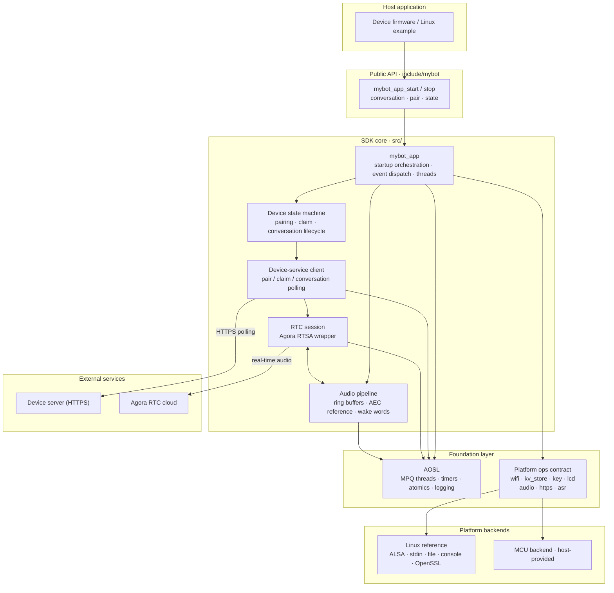
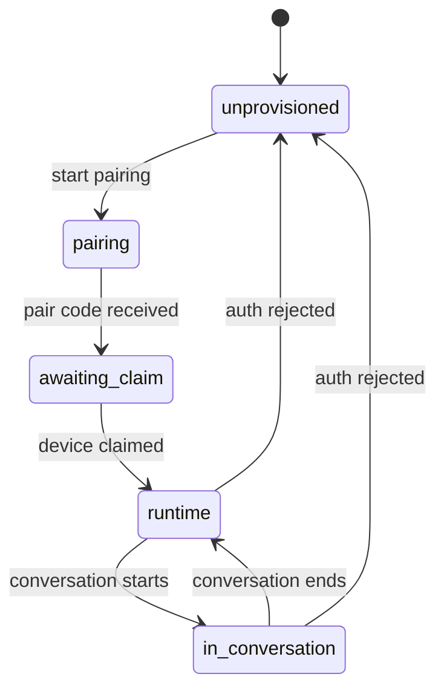
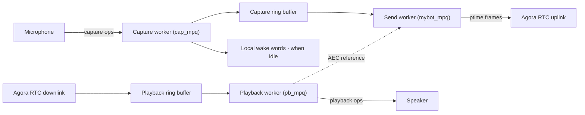

# mybot

[](https://github.com/junlon2006/mybot/actions/workflows/ci.yml)
[](LICENSE)

**[English](README.md) | [简体中文](README.zh-CN.md)**

`mybot` is a cross-platform voice-robot SDK for edge devices. It handles APSTA provisioning,
device pairing and authentication, a conversation state machine, two-way real-time audio
(Agora RTSA), button/LCD workflows, and optional local wake-word recognition. Platform-specific
capabilities are injected through a small set of `ops` interfaces, so the SDK core has no
dependency on Linux ALSA, stdin, or a particular filesystem and ports cleanly to Linux and MCU
platforms.

> Current version: **0.1.0-rc.1** — the public API is not yet stable. The bundled Agora RTSA
> binary and AOSL have separate licensing and usage terms; read
> [License and third-party dependencies](#license-and-third-party-dependencies) before using the
> SDK in a product.

## Table of Contents

- [Features](#features)
- [Boundaries and limitations](#boundaries-and-limitations)
- [Quick start](#quick-start)
- [Integrating into a host project](#integrating-into-a-host-project)
- [Build configuration](#build-configuration)
- [Architecture](#architecture)
- [Repository layout](#repository-layout)
- [Documentation](#documentation)
- [Development and verification](#development-and-verification)
- [Contributing and support](#contributing-and-support)
- [License and third-party dependencies](#license-and-third-party-dependencies)

## Features

- **Cross-platform core**: The core depends only on AOSL and the platform `ops` contract; it never
  touches any OS or peripheral API directly. The same code runs on the Linux reference platform and
  on MCU firmware.
- **APSTA provisioning**: Non-blocking startup; Wi-Fi events drive the application state machine.
- **Pairing and authentication**: Pair code → device claim → persisted long-lived credential, with
  automatic re-pairing when authentication is rejected.
- **Conversation state machine**: Five states — `unprovisioned / pairing / awaiting_claim / runtime
  / in_conversation` — drive the device-server interaction.
- **Two-way real-time audio**: Built on Agora RTSA, with cloud AEC and optional real-time
  transcription.
- **Optional local wake words**: Off by default; wake behavior is identical to starting a
  conversation with a physical button.
- **Button and LCD workflows**: Semantic screen states (provisioning / pair code / ready / in
  conversation); how each is displayed is up to the platform.
- **HTTPS transport**: The device service accepts HTTPS only by default. Linux uses OpenSSL; MCU
  platforms may integrate mbedTLS or a vendor TLS and must validate the certificate chain and host
  name.

## Boundaries and limitations

- Audio is fixed at 16 kHz, mono, 16-bit PCM; `ptime` is configurable to 20/40/60 ms (default
  60 ms).
- The RTC implementation is specific to Agora RTSA; no other RTC protocol adapter is provided.
- Local ASR wake words are an optional platform backend, off by default; enabling them requires the
  platform to register a backend.
- The Wi-Fi interface targets APSTA provisioning scenarios.
- The device server is not part of this repository; running the examples requires a compatible
  server endpoint.

## Quick start

The Linux reference platform lets you run the full workflow on a development machine. Requirements:
Linux x86_64, CMake 3.16+, a C99 compiler, and ALSA and OpenSSL development packages. The bundled
Agora RTSA static library is also the x86_64 Linux build.

```bash
sudo apt-get update
sudo apt-get install -y build-essential cmake libasound2-dev libssl-dev
cmake -S . -B build -DCONFIG_PLATFORM=linux -DMYBOT_ENABLE_ASAN=OFF
cmake --build build -j
ctest --test-dir build --output-on-failure
```

Run the example:

```bash
./build/examples/linux/mybot \
  --server https://api.example.com \
  --device-id AG-DEMO-001 \
  --fw-ver 0.1.0-rc.1 \
  --hw-model linux-reference
```

Once ready, press `s` to start a conversation, `q` to stop it, `p` to re-pair, `e` to exit.

The Linux backend is a **development stand-in**: it reuses the host network and reports STA as
connected immediately; it does not implement real APSTA provisioning. Audio uses the ALSA `default`
device. KV data is written to `.mybot-kv-store/` in the current directory by default; override the
location with the `MYBOT_KV_STORE_DIR` environment variable.

## Integrating into a host project

We recommend vendoring the repository as a source submodule. The host must provide an Agora RTSA
header and static library matching the target architecture and ensure AOSL supports the target
platform.

```cmake
set(CONFIG_PLATFORM my_mcu CACHE STRING "" FORCE)
set(AGORA_SDK_DIR /opt/agora-rtsa CACHE PATH "" FORCE)
set(AGORA_RTC_LIBRARY /opt/agora-rtsa/lib/libagora-rtc-sdk.a CACHE FILEPATH "" FORCE)

set(MYBOT_BUILD_LINUX_PLATFORM OFF CACHE BOOL "" FORCE)
set(MYBOT_BUILD_EXAMPLES OFF CACHE BOOL "" FORCE)
set(MYBOT_BUILD_TESTS OFF CACHE BOOL "" FORCE)
set(MYBOT_AUDIO_PTIME_MS 60 CACHE STRING "" FORCE)
set(MYBOT_WAKE_WORDS OFF CACHE BOOL "" FORCE)
set(MYBOT_ENABLE_HTTPS ON CACHE BOOL "" FORCE)

add_subdirectory(third_party/mybot)
target_link_libraries(device_firmware PRIVATE mybot::sdk)
```

The platform must register the Wi-Fi, KV, button, audio capture, audio playback, and HTTPS transport
backends before `mybot_app_start()`. LCD is optional; a local ASR backend is required only when
`MYBOT_WAKE_WORDS=ON`. The Linux platform registers the OpenSSL backend automatically; other
platforms must implement `mybot_https_transport_ops_t`. For the full implementation order, minimal
code, threading constraints, and acceptance checklist, see
[docs/PORTING.md](docs/PORTING.md).

Minimal application lifecycle:

```c
platform_register_all();
mybot_app_start(&config);
while (mybot_app_is_running()) {
    platform_sleep_ms(100);
}
mybot_app_stop();
```

`mybot_app_start()` is non-blocking: it starts provisioning first, then initializes storage,
buttons, audio, the device service, and RTC asynchronously once the STA-connected event arrives.
`mybot_app_stop()` waits for all worker threads to exit and must not be called from inside a
platform event callback.

## Build configuration

The following options can be set via the CMake command line or cache variables before the host's
`add_subdirectory()` call:

| Option | Default | Description |
| --- | --- | --- |
| `MYBOT_AUDIO_PTIME_MS` | `60` | Audio packet duration; accepts only 20, 40, 60 ms |
| `MYBOT_CLOUD_AEC` | `ON` | Server-side AEC; the uplink carries mic and reference channels |
| `MYBOT_WAKE_WORDS` | `OFF` | Enable the platform local-ASR wake-word backend |
| `MYBOT_AI_QOS` | `ON` | Agora AI QoS |
| `MYBOT_FAST_SEND_MULTIPLIER` | `3` | Fast-send multiplier; accepts only 1–5 |
| `MYBOT_SHOW_TRANSCRIPT` | `OFF` | Request the real-time transcription data stream |
| `MYBOT_ENABLE_HTTPS` | `ON` | Enable the platform HTTPS transport; keep ON for production builds |
| `MYBOT_ALLOW_INSECURE_HTTP` | `OFF` | Local development only: explicitly allow plaintext HTTP |
| `MYBOT_ENABLE_ASAN` | `OFF` | GCC/Clang AddressSanitizer; recommended for host tests |

For example:

```bash
cmake -S . -B build-wake \
  -DCONFIG_PLATFORM=linux \
  -DMYBOT_AUDIO_PTIME_MS=20 \
  -DMYBOT_WAKE_WORDS=ON
```

The Linux reference platform has no local ASR backend, so enabling `MYBOT_WAKE_WORDS` requires the
host to register an additional backend; otherwise the app fails to start with a clear error.

Plaintext HTTP never falls back automatically. Only in an isolated local development environment may
you configure `-DMYBOT_ENABLE_HTTPS=OFF -DMYBOT_ALLOW_INSECURE_HTTP=ON`. This combination transmits
device credentials and RTC parameters in cleartext and must not be used on devices, shared
networks, or release builds.

## Architecture

The SDK uses a layered architecture: the host application drives the core through the public API,
the core modules sit on top of the AOSL portability layer and the platform `ops` contract, and all
platform differences are absorbed by the platform backends. The device server and the Agora RTC
cloud are runtime external dependencies and are not part of this repository.



Layer notes:

- **Public API** ([include/mybot/mybot.h](include/mybot/mybot.h)): application lifecycle,
  conversation control, and state queries; non-blocking startup.
- **SDK core** ([src/](src/)): startup orchestration, the device state machine, the device-service
  HTTP client, the Agora RTSA session wrapper, audio ring buffers, and the optional local
  wake-word engine. Core code never touches any OS or peripheral API directly.
- **Foundation layer**: AOSL provides portable threads / MPQ queues / timers / logging; the
  platform `ops` contract defines the device capabilities the SDK requires. Both are implementable
  per platform.
- **Platform backends**: the Linux reference implementation and each MCU platform register against
  the same contract.
- **External services**: the device server (pairing / claim / conversation scheduling, HTTPS only)
  and Agora RTC (real-time audio).

### Threading model

`mybot_app_start()` creates five worker threads (AOSL MPQ queues) with strictly separated
responsibilities:

| Thread (MPQ) | Driven by | Responsibility |
| --- | --- | --- |
| `startup_mpq` | Wi-Fi state events | Serializes startup transitions; initializes services asynchronously after STA connects |
| `state_mpq` | 100 ms timer | Device state-machine tick; blocking HTTP polling stays on this thread |
| `mybot_mpq` | ptime timer | Sends uplink audio at the packetization cadence (Agora RTSA) |
| `cap_mpq` | ptime timer | Mic capture → capture ring buffer → (optional) wake words |
| `pb_mpq` | ptime timer | Playback ring buffer → speaker; also feeds the AEC reference channel |

The real-time audio timers (cap / pb / send) are independent, so a single blocking backend cannot
stall the whole audio path; the state machine and startup flow run on dedicated threads and never
contend with the audio cadence.

### Workflows

#### Device state machine



When device authentication is rejected, the device returns to `unprovisioned` and automatically
restarts pairing on the next state-machine tick. For the full server interaction and the
device-side state definitions, see [DEVICE_API.md](DEVICE_API.md).

#### Audio data flow



With `MYBOT_CLOUD_AEC=ON`, the downlink audio is interleaved with the microphone signal as a
reference channel and sent uplink together, letting the server cancel echo.

## Repository layout

```text
mybot/
├── include/mybot/          # public headers and platform contracts
├── src/                    # cross-platform implementation; internal/ is not public API
├── platforms/linux/        # Linux reference backends (ALSA/stdin/file/console)
├── examples/linux/         # Linux example application entry
├── tests/                  # unit, platform, and host integration tests
├── docs/                   # porting and release guides
├── cmake/                  # toolchain helpers
└── third_party/            # AOSL and the Agora RTSA SDK
```

Key CMake targets:

- `mybot::sdk` — the cross-platform SDK core (AOSL + Agora RTSA).
- `mybot::platform_linux` — the Linux reference backend; not part of the cross-platform core.
- `mybot::linux_example` — the Linux CLI example application.

## Documentation

- [docs/PORTING.md](docs/PORTING.md) — porting guide and acceptance contract
- [DEVICE_API.md](DEVICE_API.md) — device-side server API specification
- [docs/RELEASING.md](docs/RELEASING.md) — release process
- [CHANGELOG.md](CHANGELOG.md) — version history

## Development and verification

```bash
cmake -S . -B build -DCONFIG_PLATFORM=linux -DMYBOT_ENABLE_ASAN=ON
cmake --build build -j
ctest --test-dir build --output-on-failure
find include src platforms examples tests -type f \
  \( -name '*.c' -o -name '*.h' \) -print0 | xargs -0 clang-format --dry-run --Werror
```

- Owned C code follows the root `.clang-format`; `third_party/` keeps upstream content and is
  excluded from the format check.
- CI ([.github/workflows/ci.yml](.github/workflows/ci.yml)) runs the build, tests, and format check
  on every push / PR; make sure your local commands match CI before merging.

## Contributing and support

We welcome issues, discussions, and pull requests. Before you start, please read:

- [CONTRIBUTING.md](CONTRIBUTING.md) — development workflow and contribution guidelines
- [CODE_OF_CONDUCT.md](CODE_OF_CONDUCT.md) — community code of conduct
- [SUPPORT.md](SUPPORT.md) — how to get help
- [SECURITY.md](SECURITY.md) — how to report security vulnerabilities

## License and third-party dependencies

Our own code is released under the Apache License 2.0 in the root [LICENSE](LICENSE). This does not
change the licensing of third-party components:

- AOSL carries additional conditions listed in `third_party/aosl/LICENSE`.
- The Agora RTSA SDK binary is subject to its software license, trial period, and commercial
  licensing requirements.
- `mybot_json` is derived from cJSON and retains the MIT license notice.

Verify these terms independently before shipping or redistributing a product. See
[THIRD_PARTY_NOTICES.md](THIRD_PARTY_NOTICES.md) for details.
