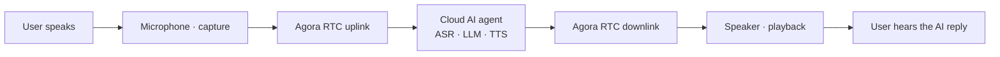
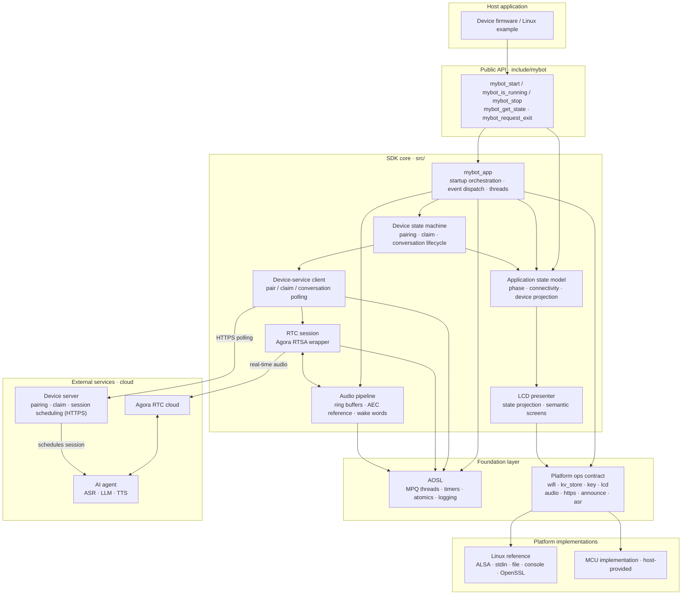
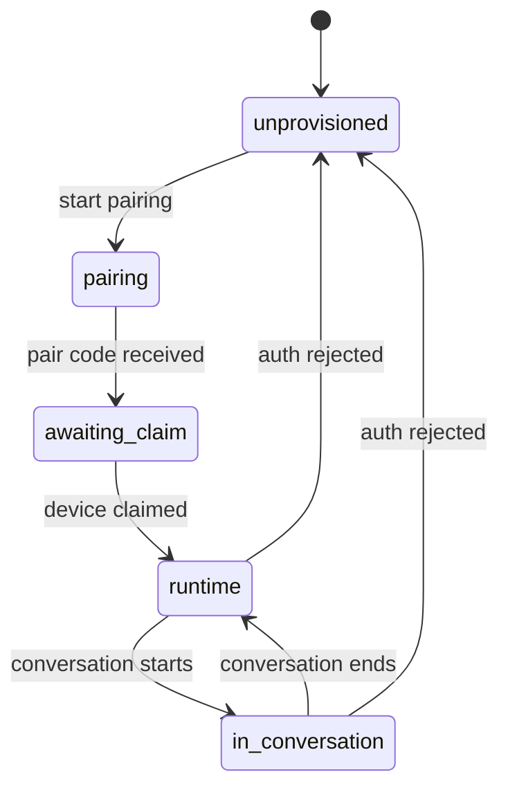
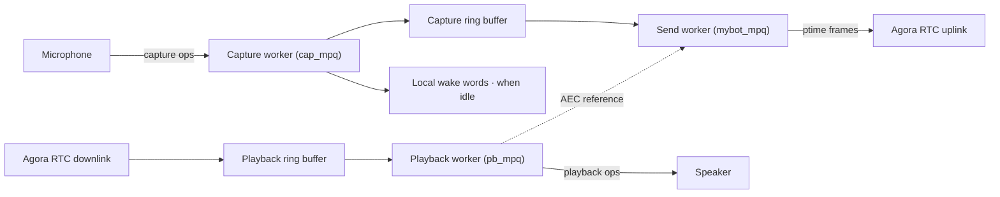

# mybot

[](https://github.com/junlon2006/mybot/actions/workflows/ci.yml)
[](LICENSE)

**[English](README.md) | [简体中文](README.zh-CN.md)**

`mybot` is a cross-platform **AI voice-chat SDK** for edge devices: it lets smart devices hold
real-time voice conversations with cloud AI agents over Agora RTC. The SDK handles APSTA
provisioning, device pairing and authentication, a conversation state machine, full-duplex voice
interaction (Agora RTSA with Agora AI capabilities), button/LCD workflows, and optional local wake-word
recognition. Platform-specific capabilities are injected through a small set of `ops` interfaces;
the core depends only on C99 and AOSL and can be ported to virtually any platform — Linux, an
RTOS, or a bare-metal MCU.

> Current version: **1.0.0**. The bundled Agora RTSA
> binary and AOSL have separate licensing and usage terms; read
> [License and third-party dependencies](#license-and-third-party-dependencies) before using the
> SDK in a product.

## Table of Contents

- [Features](#features)
- [Conversation flow](#conversation-flow)
- [Boundaries and limitations](#boundaries-and-limitations)
- [Quick start](#quick-start)
- [Integrating into a host project](#integrating-into-a-host-project)
- [Build configuration](#build-configuration)
- [Architecture](#architecture)
- [Repository layout](#repository-layout)
- [Documentation](#documentation)
- [Development and verification](#development-and-verification)
- [Contributing and support](#contributing-and-support)
- [License and third-party dependencies](#license-and-third-party-dependencies)

## Features

- **Real-time AI conversation**: Hold live voice chats with a cloud AI agent; speech recognition,
  language-model reasoning, and speech synthesis (ASR / LLM / TTS) are orchestrated in the cloud.
- **Portable to virtually any platform**: The core depends only on C99 and AOSL, and device
  capabilities are injected through the `ops` contract, so it never touches any OS or peripheral
  API directly — Linux, an RTOS, or a bare-metal MCU.
- **APSTA provisioning**: Non-blocking startup; Wi-Fi events drive the application state machine.
- **Pairing and authentication**: Pair code → device claim → persisted long-lived credential, with
  automatic re-pairing when authentication is rejected.
- **Conversation state machine**: Five device-service lifecycle states — `unprovisioned / pairing /
  awaiting_claim / runtime / in_conversation` — drive the device-server interaction.
- **Application lifecycle state**: `mybot_get_state()` exposes startup, connectivity, shutdown, and
  conversation state. After the device service accepts a conversation it returns
  `MYBOT_STATE_IN_CONVERSATION`; normal teardown returns to `MYBOT_STATE_READY`, while
  `MYBOT_STATE_WIFI_DISCONNECTED` takes precedence when connectivity is lost.
- **Full-duplex voice · barge-in**: Uplink and downlink run simultaneously; the user can interrupt
  the AI mid-reply at any time, and the microphone keeps streaming so the cloud agent hears and
  responds to new input.
- **Full-duplex voice interaction · Agora AI capabilities**: Built on Agora RTSA, with cloud AEC, AI
  QoS, and optional real-time transcription.
- **Volume control**: The SDK owns volume. When the platform registers a real-device volume
  implementation (codec / amplifier / mixer), volume changes drive hardware volume directly; otherwise
  the SDK falls back to a digital software gain applied to playback PCM. There is no
  application-facing volume API.
- **Optional local wake words**: Off by default; wake behavior is identical to starting a
  conversation with a physical button.
- **Button and LCD workflows**: Semantic screen states (provisioning / pair code / ready / in
  conversation); how each is displayed is up to the platform.
- **Pairing-code voice prompt**: Once per pair code, plays a fixed prompt ("Please enter the
  pairing code in the console") followed by one sound per digit through the normal speaker path. Assets are raw
  16 kHz mono s16 PCM files under `./assets/locales/<locale>/` (`prompt.pcm`, `0.pcm`..`9.pcm`);
  the platform owns them and the SDK core contains no audio decoder.
- **HTTPS transport**: The device service accepts HTTPS only by default. Linux uses OpenSSL; MCU
  platforms may integrate mbedTLS or a vendor TLS and must validate the certificate chain and host
  name.

## Boundaries and limitations

- Audio is fixed at 16 kHz, mono, 16-bit PCM; `ptime` is configurable to 20/40/60 ms (default
  60 ms).
- The RTC implementation is specific to Agora RTSA; no other RTC protocol adapter is provided.
- Local ASR wake words are an optional platform implementation, off by default; enabling them
  requires the platform to register an implementation.
- The Wi-Fi interface targets APSTA provisioning scenarios.
- The device server is not part of this repository; running the examples requires a compatible
  server endpoint.

## Conversation flow

The SDK establishes a real-time audio channel with a cloud AI agent over Agora RTC, forming a
complete voice conversation loop:



- **Uplink**: the device captures 16 kHz PCM from the microphone and sends it to the cloud AI agent
  over Agora RTC.
- **Cloud orchestration**: the AI agent performs speech recognition (ASR), language-model reasoning
  and reply generation (LLM), and speech synthesis (TTS).
- **Downlink**: the AI reply audio returns over Agora RTC and plays out on the device speaker.
- **Session scheduling**: the device server handles pairing / claim and allocates the RTC channel for
  each conversation.

The loop is **full-duplex**: uplink and downlink run at the same time, with no turn-taking. The user
can **interrupt** the AI at any point mid-reply — the device keeps the microphone streaming, and the
cloud agent detects the new input, stops its reply, and listens for the new command.

For the device-side audio pipeline and state machine, see [Architecture](#architecture).

## Quick start

The Linux reference platform lets you run the full workflow on a development machine. Requirements:
Linux x86_64, CMake 3.16+, a C99 compiler, and ALSA and OpenSSL development packages. The bundled
Agora RTSA static library is also the x86_64 Linux build. AOSL is pulled in as a pinned git
submodule: initialize it before the first build (or clone with `--recurse-submodules`).

```bash
git submodule update --init --recursive
sudo apt-get update
sudo apt-get install -y build-essential cmake libasound2-dev libssl-dev
cmake -S . -B build -DCONFIG_PLATFORM=linux -DMYBOT_ENABLE_ASAN=OFF
cmake --build build -j
ctest --test-dir build --output-on-failure
```

Run the example:

```bash
./build/examples/linux/mybot \
  --server https://api.example.com \
  --device-id AG-DEMO-001 \
  --fw-ver 1.0.0 \
  --hw-model linux-reference
```

The example also plays an optional pairing-code voice prompt ("Please enter the pairing code in the console...") from
`./assets/locales/<locale>/` (raw 16 kHz mono s16 PCM: `prompt.pcm`, `0.pcm`..`9.pcm`).
The default locale is `zh-CN`; set `MYBOT_LOCALE` and `MYBOT_ASSETS_DIR` to override.

Once ready, press `s` to start a conversation, `q` to stop it, `p` to re-pair, `u` / `d` to raise /
lower the volume, `e` to exit.

The Linux reference implementation is a **development stand-in**: it reuses the host network and
reports STA as connected immediately; it does not implement real APSTA provisioning. Audio uses the
ALSA `default` device. KV data is written to `.mybot-kv-store/` in the current directory by default;
override the location with the `MYBOT_KV_STORE_DIR` environment variable.

## Integrating into a host project

We recommend vendoring the repository as a source submodule, and mybot itself depends on AOSL
through a nested submodule — initialize submodules after adding it with
`git submodule update --init --recursive`.
The host must provide an Agora RTSA header and static library matching the target architecture and
ensure AOSL supports the target platform.

An installed package is also supported: `cmake --install` exports `mybot::sdk` (and the bundled
`mybot::aosl`), and a consumer project can use `find_package(mybot CONFIG REQUIRED)` after pointing
`MYBOT_AGORA_SDK_DIR` / `MYBOT_AGORA_RTC_LIBRARY` at a target-architecture Agora RTSA package.

```cmake
set(CONFIG_PLATFORM my_mcu CACHE STRING "" FORCE)
set(AGORA_SDK_DIR /opt/agora-rtsa CACHE PATH "" FORCE)
set(AGORA_RTC_LIBRARY /opt/agora-rtsa/lib/libagora-rtc-sdk.a CACHE FILEPATH "" FORCE)

set(MYBOT_BUILD_LINUX_PLATFORM OFF CACHE BOOL "" FORCE)
set(MYBOT_BUILD_EXAMPLES OFF CACHE BOOL "" FORCE)
set(MYBOT_BUILD_TESTS OFF CACHE BOOL "" FORCE)
set(MYBOT_AUDIO_PTIME_MS 60 CACHE STRING "" FORCE)
set(MYBOT_WAKE_WORDS OFF CACHE BOOL "" FORCE)
set(MYBOT_ENABLE_HTTPS ON CACHE BOOL "" FORCE)

add_subdirectory(third_party/mybot)
target_link_libraries(device_firmware PRIVATE mybot::sdk)
```

The platform must register the Wi-Fi, KV, key, audio capture, audio playback, and HTTPS transport
implementations before `mybot_start()`. The LCD and pairing-code announcement implementations are
optional; the local ASR implementation is required only when `MYBOT_WAKE_WORDS=ON`. The Linux
platform registers the OpenSSL implementation automatically; other platforms must implement
`mybot_https_ops_t`. For the full implementation order, minimal code, threading constraints, and
acceptance checklist, see [docs/PORTING.md](docs/PORTING.md).

Minimal application lifecycle:

```c
platform_register_all();
mybot_start(&config);
while (mybot_is_running()) {
    platform_sleep_ms(100);
}
mybot_stop();
```

`mybot_start()` is non-blocking: it starts provisioning first, then initializes storage,
buttons, audio, the device service, and RTC asynchronously once usable network connectivity is
reported.
`mybot_stop()` waits for all worker threads to exit and must not be called from inside a
platform event callback. The application acquires one reference to the process-wide AOSL runtime
inside `mybot_start()` and releases it at the end of `mybot_stop()`. Agora RTC acquires and releases
its own independent AOSL reference in `agora_rtc_init()` / `agora_rtc_fini()`. A host that uses AOSL
directly must keep its own `aosl_ctor()` / `aosl_dtor()` pair balanced; the runtime is finalized only
after every consumer has released its reference.

## Build configuration

The following options can be set via the CMake command line or cache variables before the host's
`add_subdirectory()` call:

| Option | Default | Description |
| --- | --- | --- |
| `MYBOT_AUDIO_PTIME_MS` | `60` | Audio packet duration; accepts only 20, 40, 60 ms |
| `MYBOT_CLOUD_AEC` | `ON` | Server-side AEC; the uplink carries mic and reference channels |
| `MYBOT_WAKE_WORDS` | `OFF` | Enable the platform local-ASR wake-word implementation |
| `MYBOT_AI_QOS` | `ON` | Agora AI QoS |
| `MYBOT_FAST_SEND_MULTIPLIER` | `3` | Fast-send multiplier; accepts only 1–5 |
| `MYBOT_SHOW_TRANSCRIPT` | `OFF` | Request the real-time transcription data stream |
| `MYBOT_ENABLE_HTTPS` | `ON` | Enable the platform HTTPS transport; keep ON for production builds |
| `MYBOT_ALLOW_INSECURE_HTTP` | `OFF` | Local development only: explicitly allow plaintext HTTP |
| `MYBOT_ENABLE_ASAN` | `OFF` | GCC/Clang AddressSanitizer; recommended for host tests |
| `MYBOT_ENABLE_UBSAN` | `OFF` | GCC/Clang UndefinedBehaviorSanitizer; recommended for host tests |
| `MYBOT_ENABLE_COVERAGE` | `OFF` | Instrument mybot targets for gcov; used by the CI coverage job |

Two independent variables select platform code: `CONFIG_PLATFORM` chooses the AOSL HAL port
consumed by `third_party/aosl` (e.g. `linux`, `esp32`), while `MYBOT_BUILD_LINUX_PLATFORM` builds
the bundled Linux reference implementations (`platforms/linux/`: ALSA, stdin, file KV, console LCD,
OpenSSL) and requires `CONFIG_PLATFORM=linux`. An MCU port sets `CONFIG_PLATFORM=my_mcu` and keeps
`MYBOT_BUILD_LINUX_PLATFORM=OFF`.

For example:

```bash
cmake -S . -B build-wake \
  -DCONFIG_PLATFORM=linux \
  -DMYBOT_AUDIO_PTIME_MS=20 \
  -DMYBOT_WAKE_WORDS=ON
```

The Linux reference platform has no local ASR implementation, so enabling `MYBOT_WAKE_WORDS`
requires the host to register an additional implementation; otherwise the app fails to start with a
clear error.

Plaintext HTTP never falls back automatically. Only in an isolated local development environment may
you configure `-DMYBOT_ENABLE_HTTPS=OFF -DMYBOT_ALLOW_INSECURE_HTTP=ON`. This combination transmits
device credentials and RTC parameters in cleartext and must not be used on devices, shared
networks, or release builds.

## Architecture

The SDK uses a layered architecture: the host application drives the core through the public API,
the core modules sit on top of the AOSL portability layer and the platform `ops` contract, and all
platform differences are absorbed by the platform implementations. The device server, the Agora RTC cloud,
and the cloud AI agent are runtime external dependencies and are not part of this repository.



Layer notes:

- **Public API** ([include/mybot/mybot.h](include/mybot/mybot.h)): application lifecycle and
  state queries (`mybot_start` / `mybot_is_running` / `mybot_get_state` / `mybot_request_exit` /
  `mybot_stop`); non-blocking startup. Use `mybot_get_state()` for key or UI decisions:
  `MYBOT_STATE_READY` can start a conversation and `MYBOT_STATE_IN_CONVERSATION` can stop one.
  LCD output is only a rendering result, not a source of lifecycle state. Conversation and pairing
  actions are triggered by platform key / wake-word events and handled inside the SDK core. Wi-Fi
  and device-lifecycle events update one atomic state-model snapshot; `mybot_get_state()` and the LCD
  presenter derive their views from that same snapshot.
- **SDK core** ([src/](src/)): startup orchestration, the device state machine, the device-service
  HTTP client, the Agora RTSA session wrapper, audio ring buffers, and the optional local
  wake-word engine. Core code never touches any OS or peripheral API directly.
- **Foundation layer**: AOSL provides portable threads / MPQ queues / timers / logging; the
  platform `ops` contract defines the device capabilities the SDK requires. Both are implementable
  per platform.
- **Platform implementations**: the Linux reference implementation and each MCU platform register
  against the same contract.
- **External services**: the device server (pairing / claim / session scheduling, HTTPS only), the
  Agora RTC cloud (real-time audio transport), and the cloud AI agent (speech recognition /
  understanding / synthesis).

### Threading model

`mybot_start()` creates five worker threads (AOSL MPQ queues) with strictly separated
responsibilities:

| Thread (MPQ) | Driven by | Responsibility |
| --- | --- | --- |
| `startup_mpq` | Wi-Fi connectivity events | Serializes startup transitions; initializes services asynchronously when the network is ready |
| `state_mpq` | 100 ms timer | Device state-machine tick; blocking HTTP polling stays on this thread |
| `mybot_mpq` | ptime timer | Sends uplink audio at the packetization cadence (Agora RTSA) |
| `cap_mpq` | ptime timer | Mic capture → capture ring buffer → (optional) wake words |
| `pb_mpq` | ptime timer | Playback ring buffer → speaker; also feeds the AEC reference channel |

The real-time audio timers (cap / pb / send) are independent, so a single blocking
implementation cannot stall the whole audio path; the state machine and startup flow run on
dedicated threads and never contend with the audio cadence.

### Workflows

#### Device state machine



When device authentication is rejected, the device returns to `unprovisioned` and automatically
restarts pairing on the next state-machine tick.

#### Audio data flow



With `MYBOT_CLOUD_AEC=ON`, the downlink audio is interleaved with the microphone signal as a
reference channel and sent uplink together, letting the server cancel echo. The uplink and downlink
run concurrently (**full-duplex**): the microphone keeps streaming during AI replies, which is what
lets the cloud agent support user interruption.

## Repository layout

```text
mybot/
├── include/mybot/          # public headers and platform interface specifications
├── src/                    # cross-platform implementation; internal/ is not public API
├── platforms/linux/        # Linux reference implementations (ALSA/stdin/file/console)
├── examples/linux/         # Linux example application entry
├── tests/                  # unit, platform, and host integration tests
├── docs/                   # porting and release guides
├── cmake/                  # toolchain helpers
└── third_party/            # AOSL submodule and the Agora RTSA SDK
```

Key CMake targets:

- `mybot::sdk` — the cross-platform SDK core (AOSL + Agora RTSA).
- `mybot::platform_linux` — the Linux reference implementation; not part of the cross-platform core.
- `mybot::linux_example` — the Linux CLI example application.

## Documentation

- [docs/PORTING.md](docs/PORTING.md) ([简体中文](docs/PORTING.zh-CN.md)) — porting guide and
  acceptance checklist
- [docs/EMBEDDED.md](docs/EMBEDDED.md) ([简体中文](docs/EMBEDDED.zh-CN.md)) — footprint, memory,
  thread/stack, timing, power and logging guidance for MCU integrators
- [docs/RELEASING.md](docs/RELEASING.md) ([简体中文](docs/RELEASING.zh-CN.md)) — release process
- [CHANGELOG.md](CHANGELOG.md) — version history
- API reference — generated by Doxygen from the public headers with
  `doxygen build/docs/Doxyfile`; CI builds it on every push / PR and publishes it as an artifact

## Development and verification

```bash
cmake -S . -B build -DCONFIG_PLATFORM=linux -DMYBOT_ENABLE_ASAN=ON
cmake --build build -j
ctest --test-dir build --output-on-failure
find include src platforms examples tests -type f \
  \( -name '*.c' -o -name '*.h' \) -print0 | xargs -0 clang-format --dry-run --Werror
```

- Owned C code follows the root `.clang-format`; `third_party/` keeps upstream content and is
  excluded from the format check.
- CI ([.github/workflows/ci.yml](.github/workflows/ci.yml)) runs the build, tests, and format check
  on every push / PR; make sure your local commands match CI before merging.
- CI builds with both GCC and Clang under ASan and UBSan, runs cppcheck and clang-tidy static
  analysis, and publishes gcov/lcov coverage to Codecov.
- Commit messages follow Conventional Commits (see `CONTRIBUTING.md`). Install the local
  `commit-msg` hook once per clone with `./scripts/setup-githooks.sh`; CI validates every pushed /
  PR commit subject.

## Contributing and support

We welcome issues, discussions, and pull requests. Before you start, please read (each document is
available in English and Simplified Chinese):

- [CONTRIBUTING](CONTRIBUTING.md) ([简体中文](CONTRIBUTING.zh-CN.md)) — development workflow and contribution guidelines
- [SUPPORT](SUPPORT.md) ([简体中文](SUPPORT.zh-CN.md)) — how to get help

## License and third-party dependencies

Our own code is released under the Apache License 2.0 in the root [LICENSE](LICENSE). This does not
change the licensing of third-party components:

- AOSL carries additional conditions listed in `third_party/aosl/LICENSE`.
- The Agora RTSA SDK binary is subject to its software license, trial period, and commercial
  licensing requirements. The bundled x86_64 Linux binary is for development/demo use only;
  commercial or production use and redistribution require authorization from Agora (声网) — contact
  Agora's sales channel before shipping or redistributing it.
- `mybot_json` is derived from cJSON and retains the MIT license notice.

Verify these terms independently before shipping or redistributing a product. See
[THIRD_PARTY_NOTICES.md](THIRD_PARTY_NOTICES.md) for details.
