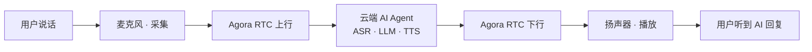
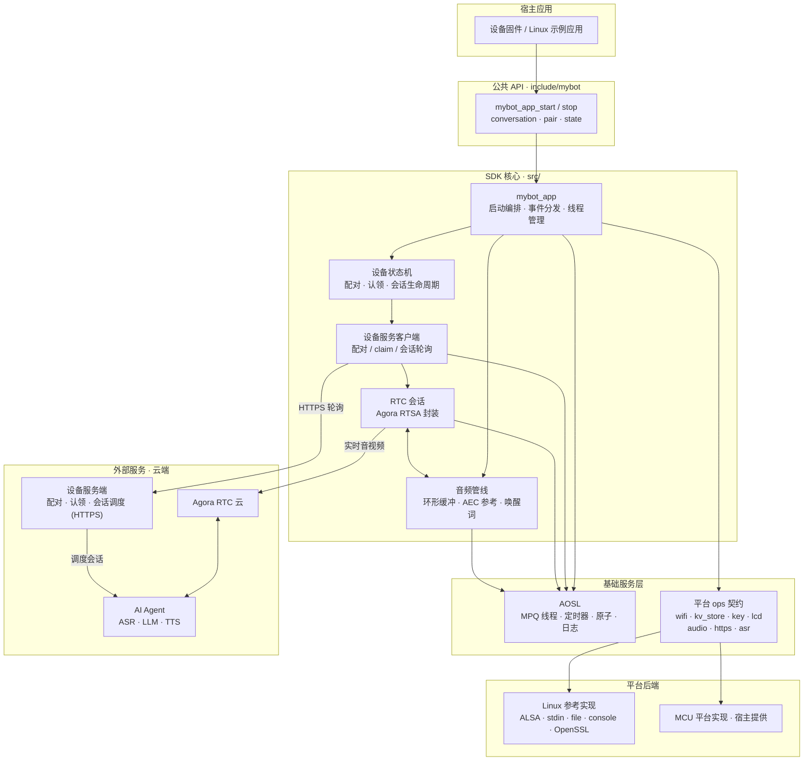
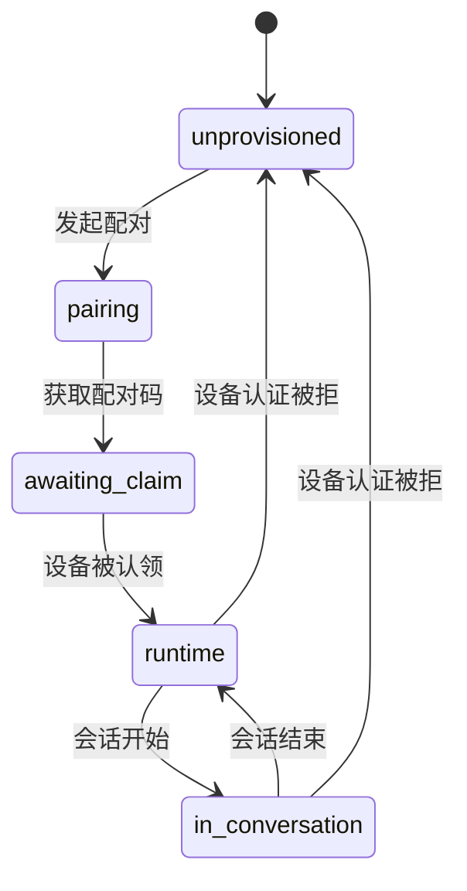
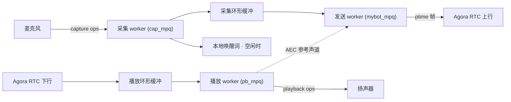

# mybot

[](https://github.com/junlon2006/mybot/actions/workflows/ci.yml)
[](LICENSE)

**[English](README.md) | 简体中文**

`mybot` 是面向设备端的跨平台 **AI 语音对话 SDK**：让智能设备通过声网 Agora RTC 与
云端 AI Agent 进行实时语音聊天。SDK 负责 APSTA 配网、设备配对与认证、会话状态机、
全双工语音交互（Agora RTSA 与 Agora AI 能力）、按键/LCD 工作流以及可选的本地唤醒词
识别。平台相关能力通过一组小型 `ops` 接口注入，SDK 核心只依赖 C99 与 AOSL，理论上
可移植到任意平台——Linux、RTOS 或裸机 MCU。

> 当前版本为 **0.1.0-rc.1**，公开 API 尚未承诺稳定。仓库内置的 Agora RTSA 二进制与
> AOSL 有独立的许可及使用条件；用于产品前请阅读[许可证与第三方依赖](#许可证与第三方依赖)。

## 目录

- [功能特性](#功能特性)
- [对话流程](#对话流程)
- [边界与限制](#边界与限制)
- [快速开始](#快速开始)
- [集成到宿主工程](#集成到宿主工程)
- [构建配置](#构建配置)
- [系统架构](#系统架构)
- [仓库结构](#仓库结构)
- [文档](#文档)
- [开发与验证](#开发与验证)
- [贡献与支持](#贡献与支持)
- [许可证与第三方依赖](#许可证与第三方依赖)

## 功能特性

- **AI 实时对话**：与云端 AI Agent 进行实时语音聊天，语音识别 / 大模型理解 / 语音合成
  （ASR / LLM / TTS）由云端编排。
- **任意平台可移植**：核心只依赖 C99 与 AOSL，设备能力通过 `ops` 契约注入，不直接触碰
  任何 OS 或外设 API；理论上可移植到 Linux、RTOS、裸机等任意平台。
- **APSTA 配网**：非阻塞启动，通过 Wi-Fi 事件驱动应用状态机推进。
- **配对与认证**：配对码 → 设备认领 → 长期凭证持久化，认证失效时自动重新配对。
- **会话状态机**：`unprovisioned / pairing / awaiting_claim / runtime / in_conversation`
  五态驱动设备服务端交互。
- **全双工语音 · 支持打断**：上行与下行同时进行；AI 回复期间用户可随时说话打断，
  麦克风持续上行，云端 Agent 感知新输入并即时响应。
- **全双工语音交互 · Agora AI 能力**：基于 Agora RTSA，支持云端 AEC、AI QoS 与可选
  实时转写。
- **音量控制**：两个相互独立的层次——SDK 管理的媒体音量（对播放 PCM 做数字软件增益，
  所有平台可用）与可选的设备真实音量后端（Codec / 功放 / 混音器），由平台注册。
- **可选的本地唤醒词**：默认关闭；唤醒行为与物理按键启动会话一致。
- **按键与 LCD 工作流**：语义化屏幕状态（配网 / 配对码 / 就绪 / 会话中），显示方式由
  平台决定。
- **HTTPS 安全传输**：设备服务默认仅接受 HTTPS；Linux 使用 OpenSSL，MCU 可接入
  mbedTLS 或芯片厂商 TLS，并校验证书链与主机名。

## 边界与限制

- 音频格式固定为 16 kHz、单声道、16-bit PCM；`ptime` 可配置为 20/40/60 ms，默认
  60 ms。
- RTC 实现专用于 Agora RTSA，不提供其他 RTC 协议适配层。
- 本地 ASR 唤醒词为可选平台后端，默认关闭；开启时必须由平台注册后端。
- Wi-Fi 接口面向 APSTA 配网场景。
- 设备服务端不属于本仓库；运行示例与联调需要兼容的服务端地址。

## 对话流程

SDK 通过 Agora RTC 与云端 AI Agent 建立实时音频通道，形成完整的语音对话回路：



- **上行**：设备麦克风采集 16 kHz PCM，经 Agora RTC 上行至云端 AI Agent。
- **云端编排**：AI Agent 完成语音识别（ASR）、大模型理解与回答（LLM）、语音合成（TTS）。
- **下行**：AI 回复音频经 Agora RTC 下行回到设备扬声器播放。
- **会话调度**：设备服务端负责配对 / 认领，并为每次对话分配 RTC 频道。

整条回路是**全双工**的：上行与下行同时进行，无需轮替发言。AI 回复期间用户随时可以说话
**打断**——设备保持麦克风上行，云端 Agent 检测到用户输入后即中断回复并转听新指令。

设备侧的音频链路与状态机实现见[系统架构](#系统架构)。

## 快速开始

Linux 参考平台用于在开发机上快速跑通完整工作流。环境要求：Linux x86_64、CMake 3.16+、
C99 编译器、ALSA 与 OpenSSL 开发包。仓库附带的 Agora RTSA 静态库为 x86_64 Linux 版本。

```bash
sudo apt-get update
sudo apt-get install -y build-essential cmake libasound2-dev libssl-dev
cmake -S . -B build -DCONFIG_PLATFORM=linux -DMYBOT_ENABLE_ASAN=OFF
cmake --build build -j
ctest --test-dir build --output-on-failure
```

运行示例：

```bash
./build/examples/linux/mybot \
  --server https://api.example.com \
  --device-id AG-DEMO-001 \
  --fw-ver 0.1.0-rc.1 \
  --hw-model linux-reference
```

就绪后输入 `s` 开始会话、`q` 停止会话、`p` 重新配对、`u` / `d` 增大 / 减小媒体音量、
`e` 退出。

Linux 后端是**开发替身**：它直接使用宿主机现有网络并立即报告 STA 已连接，不实现真实
APSTA 配网；音频使用 ALSA `default` 设备；KV 数据默认写入当前目录的 `.mybot-kv-store/`，
可用环境变量 `MYBOT_KV_STORE_DIR` 修改。

## 集成到宿主工程

推荐将仓库作为源码子模块引入。宿主需要为目标架构准备匹配的 Agora RTSA 头文件/静态库，
并确保 AOSL 已支持目标平台。

也支持已安装包：`cmake --install` 会导出 `mybot::sdk`（及随附的 `mybot::aosl`），消费工程将
`MYBOT_AGORA_SDK_DIR` / `MYBOT_AGORA_RTC_LIBRARY` 指向目标架构的 Agora RTSA 包后，即可用
`find_package(mybot CONFIG REQUIRED)` 引入。

```cmake
set(CONFIG_PLATFORM my_mcu CACHE STRING "" FORCE)
set(AGORA_SDK_DIR /opt/agora-rtsa CACHE PATH "" FORCE)
set(AGORA_RTC_LIBRARY /opt/agora-rtsa/lib/libagora-rtc-sdk.a CACHE FILEPATH "" FORCE)

set(MYBOT_BUILD_LINUX_PLATFORM OFF CACHE BOOL "" FORCE)
set(MYBOT_BUILD_EXAMPLES OFF CACHE BOOL "" FORCE)
set(MYBOT_BUILD_TESTS OFF CACHE BOOL "" FORCE)
set(MYBOT_AUDIO_PTIME_MS 60 CACHE STRING "" FORCE)
set(MYBOT_WAKE_WORDS OFF CACHE BOOL "" FORCE)
set(MYBOT_ENABLE_HTTPS ON CACHE BOOL "" FORCE)

add_subdirectory(third_party/mybot)
target_link_libraries(device_firmware PRIVATE mybot::sdk)
```

平台必须在 `mybot_app_start()` 之前注册 Wi-Fi、KV、按键、音频采集、音频播放和
HTTPS 传输后端。LCD 可选；只有 `MYBOT_WAKE_WORDS=ON` 时才必须注册本地 ASR 后端。
Linux 平台自动注册 OpenSSL 后端；其他平台需实现 `mybot_https_ops_t`。
完整实现顺序、最小代码、线程约束和验收清单见 [docs/PORTING.md](docs/PORTING.md)。

最小应用生命周期：

```c
platform_register_all();
mybot_app_start(&config);
while (mybot_app_is_running()) {
    platform_sleep_ms(100);
}
mybot_app_stop();
```

`mybot_app_start()` 非阻塞：先启动配网，收到 STA connected 事件后才异步初始化存储、
按键、音频、设备服务和 RTC。`mybot_app_stop()` 会等待全部工作线程退出，因此不应从
平台事件回调内部调用。

## 构建配置

以下选项可在宿主 `add_subdirectory()` 之前通过 CMake 命令行或缓存变量设置：

| 选项 | 默认值 | 说明 |
| --- | --- | --- |
| `MYBOT_AUDIO_PTIME_MS` | `60` | 音频包长，只接受 20、40、60 ms |
| `MYBOT_CLOUD_AEC` | `ON` | 服务端 AEC；上行包含麦克风和参考声道 |
| `MYBOT_WAKE_WORDS` | `OFF` | 启用本地 ASR 唤醒词平台后端 |
| `MYBOT_AI_QOS` | `ON` | Agora AI QoS |
| `MYBOT_FAST_SEND_MULTIPLIER` | `3` | 快发倍数，只接受 1 到 5 |
| `MYBOT_SHOW_TRANSCRIPT` | `OFF` | 请求实时转写数据流 |
| `MYBOT_ENABLE_HTTPS` | `ON` | 启用平台 HTTPS 传输，生产构建应保持开启 |
| `MYBOT_ALLOW_INSECURE_HTTP` | `OFF` | 仅本地开发：显式允许明文 HTTP |
| `MYBOT_ENABLE_ASAN` | `OFF` | GCC/Clang 地址消毒器，建议在宿主测试中开启 |
| `MYBOT_ENABLE_UBSAN` | `OFF` | GCC/Clang 未定义行为消毒器，建议在宿主测试中开启 |
| `MYBOT_ENABLE_COVERAGE` | `OFF` | 为 gcov 代码覆盖率插桩；CI 覆盖率任务使用 |

两个相互独立的变量选择平台代码：`CONFIG_PLATFORM` 选择 `third_party/aosl` 消费的 AOSL HAL
端口（如 `linux`、`esp32`）；`MYBOT_BUILD_LINUX_PLATFORM` 构建随附的 Linux 参考后端
（`platforms/linux/`：ALSA、stdin、文件 KV、控制台 LCD、OpenSSL），并要求
`CONFIG_PLATFORM=linux`。MCU 移植设置 `CONFIG_PLATFORM=my_mcu` 并保持
`MYBOT_BUILD_LINUX_PLATFORM=OFF`。

例如：

```bash
cmake -S . -B build-wake \
  -DCONFIG_PLATFORM=linux \
  -DMYBOT_AUDIO_PTIME_MS=20 \
  -DMYBOT_WAKE_WORDS=ON
```

Linux 参考平台没有本地 ASR 后端，开启 `MYBOT_WAKE_WORDS` 后需要由宿主额外注册后端，
否则应用会明确启动失败。

明文 HTTP 不会自动回退。仅在隔离的本地开发环境中，可显式配置
`-DMYBOT_ENABLE_HTTPS=OFF -DMYBOT_ALLOW_INSECURE_HTTP=ON`。该组合会以明文传输设备
凭据和 RTC 参数，不得用于设备、共享网络或发布构建。

## 系统架构

SDK 采用分层架构：宿主应用通过公共 API 驱动核心，核心模块建立在 AOSL 可移植运行层
与平台 `ops` 契约之上，平台差异全部由各平台后端实现收敛。设备服务端、Agora RTC 云与
云端 AI Agent 是运行时依赖的外部服务，均不在本仓库内。



分层说明：

- **公共 API**（[include/mybot/mybot.h](include/mybot/mybot.h)）：应用生命周期、会话
  控制与状态查询，非阻塞启动。
- **SDK 核心**（[src/](src/)）：启动编排、设备状态机、设备服务 HTTP 客户端、Agora
  RTSA 会话封装、音频环形缓冲与可选本地唤醒词。核心代码不直接触碰任何 OS 或外设 API。
- **基础服务层**：AOSL 提供线程 / MPQ / 定时器 / 日志等可移植能力；平台 `ops` 契约
  定义 SDK 所需的设备能力接口，两者都可由具体平台实现。
- **平台后端**：Linux 参考实现与各 MCU 平台按同一契约注册。
- **外部服务**：设备服务端（配对 / 认领 / 会话调度，仅 HTTPS）、Agora RTC 云（实时音频
  传输）与云端 AI Agent（语音识别 / 理解 / 合成）。

### 线程模型

`mybot_app_start()` 在 AOSL 上创建 5 个工作线程（MPQ），职责严格隔离：

| 线程 (MPQ) | 驱动 | 职责 |
| --- | --- | --- |
| `startup_mpq` | Wi-Fi 状态事件 | 串行化启动过渡；STA connected 后异步初始化各项服务 |
| `state_mpq` | 100 ms 定时器 | 设备状态机 tick；阻塞式 HTTP 轮询独立于此线程 |
| `mybot_mpq` | ptime 定时器 | 按音频包长节奏发送上行音频（Agora RTSA） |
| `cap_mpq` | ptime 定时器 | 麦克风采集 → 采集环形缓冲 →（可选）唤醒词 |
| `pb_mpq` | ptime 定时器 | 播放环形缓冲 → 扬声器，同时生成 AEC 参考声道 |

实时音频定时器（cap / pb / send）相互独立，单个阻塞后端不会拖垮整条音频链路；
状态机与启动流程使用专用线程，不抢占音频节拍。

### 工作流

#### 设备状态机



设备认证被拒后回到 `unprovisioned`，并在下一个状态机 tick 自动重新发起配对。

#### 音频数据流



`MYBOT_CLOUD_AEC=ON` 时，下行音频作为参考声道与麦克风交织后一起上行，由服务端消除回声。
上行与下行同时运行（**全双工**）：AI 回复期间麦克风仍持续采集上行，这是云端 Agent 支持
用户打断的基础。

## 仓库结构

```text
mybot/
├── include/mybot/          # SDK 公共头文件和平台契约
├── src/                    # 跨平台实现；internal/ 不属于公共 API
├── platforms/linux/        # Linux 参考后端（ALSA/stdin/file/console）
├── examples/linux/         # Linux 示例应用入口
├── tests/                  # 单元、平台和宿主集成测试
├── docs/                   # 移植与发布指南
├── cmake/                  # 工具链辅助文件
└── third_party/            # AOSL 与 Agora RTSA SDK
```

主要 CMake 目标：

- `mybot::sdk`：跨平台 SDK 核心（AOSL + Agora RTSA）。
- `mybot::platform_linux`：Linux 参考后端，不属于跨平台核心。
- `mybot::linux_example`：Linux CLI 示例应用。

## 文档

- [docs/PORTING.md](docs/PORTING.md)（[简体中文](docs/PORTING.zh-CN.md)）— 新平台移植指南
  与验收契约
- [docs/EMBEDDED.md](docs/EMBEDDED.md)（[简体中文](docs/EMBEDDED.zh-CN.md)）— 面向 MCU
  集成者的体积、内存、线程/栈、时序、功耗与日志说明
- [docs/RELEASING.md](docs/RELEASING.md)（[简体中文](docs/RELEASING.zh-CN.md)）— 版本发布流程
- [CHANGELOG.md](CHANGELOG.md) — 版本变更记录
- API 参考 — 由 Doxygen 从公共头文件生成，命令为 `doxygen build/docs/Doxyfile`；CI 在每个
  push / PR 构建并以工件形式发布

## 开发与验证

```bash
cmake -S . -B build -DCONFIG_PLATFORM=linux -DMYBOT_ENABLE_ASAN=ON
cmake --build build -j
ctest --test-dir build --output-on-failure
find include src platforms examples tests -type f \
  \( -name '*.c' -o -name '*.h' \) -print0 | xargs -0 clang-format --dry-run --Werror
```

- 自研 C 代码遵循根目录 `.clang-format`；`third_party/` 保持上游内容，不参与格式化检查。
- CI（[.github/workflows/ci.yml](.github/workflows/ci.yml)）在每个 push / PR 上执行
  构建、测试与格式检查，提交前请确保本地命令与 CI 一致。
- CI 使用 GCC 与 Clang 双编译器分别在 ASan、UBSan 下构建，运行 cppcheck 与 clang-tidy
  静态分析，并向 Codecov 发布 gcov/lcov 覆盖率。
- 提交信息遵循 Conventional Commits（见 `CONTRIBUTING.md`）。每个克隆执行一次
  `./scripts/setup-githooks.sh` 安装本地 `commit-msg` hook；CI 会校验每个 push / PR 的
  提交主题行。

## 贡献与支持

欢迎提交 issue、讨论与 PR。开始之前请阅读（以下文档均提供中英双语）：

- [CONTRIBUTING](CONTRIBUTING.md)（[简体中文](CONTRIBUTING.zh-CN.md)）— 开发流程与提交规范
- [CODE_OF_CONDUCT](CODE_OF_CONDUCT.md)（[简体中文](CODE_OF_CONDUCT.zh-CN.md)）— 社区行为准则
- [SUPPORT](SUPPORT.md)（[简体中文](SUPPORT.zh-CN.md)）— 获取支持的方式
- [SECURITY](SECURITY.md)（[简体中文](SECURITY.zh-CN.md)）— 安全漏洞报告流程

## 许可证与第三方依赖

仓库自研代码按根目录 [LICENSE](LICENSE) 中的 Apache License 2.0 发布，但这不改变第三方
组件的许可：

- AOSL 带有其 `third_party/aosl/LICENSE` 中列出的附加条件。
- Agora RTSA SDK 二进制受其软件许可、试用期和商业授权要求约束。
- `mybot_json` 派生自 cJSON，保留 MIT 许可声明。

发布产品或重新分发前必须单独核实这些条款。详见 [THIRD_PARTY_NOTICES.md](THIRD_PARTY_NOTICES.md)。
